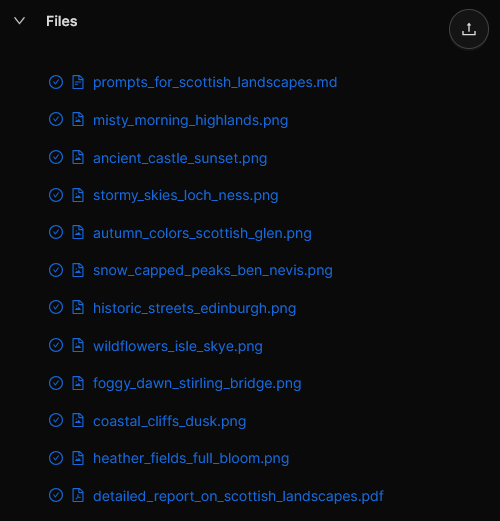

# FLUX.1-schnell Image Generation Agent

An OpenServ agent that generates images using the FLUX.1-schnell model from Hugging Face. The agent can create images from text descriptions and upload them directly to OpenServ workspaces.


**Note:** This agent is built upon the [Agent Starter](https://github.com/openserv-labs/agent-starter), which provides a minimal setup to help you understand the basics of the [OpenServ Labs SDK](https://github.com/openserv-labs/sdk) and create your own agents.


## Setup

1. Clone this repository
2. Install dependencies:

```bash
npm install
```

3. Copy `.env.example` to `.env` and fill in your configuration:

```bash
cp .env.example .env
```

4. Update the environment variables in `.env`:
   - `OPENSERV_API_KEY`: Your OpenServ Labs API key
   - `HF_ACCESS_TOKEN`: Your Hugging Face API key

   **Note:** If you want to run agent.process(), you also need to set OPENAI_API_KEY in .env

## Development

Run the development server with hot reload:

```bash
npm run dev
```

## Usage

The agent provides two main capabilities:

1. generateImage:
   ```typescript
   {
     prompt: "A detailed description of the image you want",
     workspaceId: 123, // Your OpenServ workspace ID
     filename: "output.png" // Optional, defaults to generated_image.png
   }
   ```

2. help:
   Returns example prompts and usage instructions.

Example Prompts:
- "A majestic ancient library at dusk, illuminated by warm golden chandeliers"
- "A futuristic cityscape with flying cars and neon lights"
- "A serene mountain landscape with a crystal clear lake"

## Implementation Details

The agent uses:
- FLUX.1-schnell model for image generation
- OpenServ SDK for workspace integration
- Zod for request validation

The generated images are uploaded directly to the specified workspace and can be accessed through the OpenServ platform.



## Example Outputs

Here are some images generated by the agent, located in the `example-outputs/` directory:


## Code Quality

The project uses ESLint and Prettier for code quality and formatting:

```bash
# Run ESLint
npm run lint

# Fix ESLint issues
npm run lint:fix

# Format code with Prettier
npm run format
```

## Building

Build the project:

```bash
npm run build
```

Run the built version:

```bash
npm start
```

## Notes

- The project is set up with TypeScript, ts-node-dev for development, and includes VS Code debugging configuration
- Environment variables are validated using Zod
- ESLint and Prettier are configured for consistent code style
- The agent uses natural language processing to understand and execute commands

## Next Steps

Once you're comfortable with the basics, explore more advanced features in the [OpenServ Labs SDK](https://github.com/openserv-labs/sdk):
- Tasks and workflows
- Chat interactions
- File operations
- Custom capabilities
- Inter-agent collaboration
